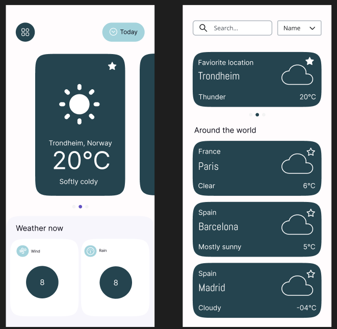

# Whirlwind Weather Forecast


## How to run

Before running the application or any tests, make sure you are in the project's root directory. After that you have to run `npm install`.

### Running the application

You can then run the application locally by using `npm run dev`. This will make the application accessible at localhost.

### Running the tests

You can run the tests by using `npm run tests`. This will run all the tests, including snapshot and unit tests.

### Accessing the application through the VM

If you are connected to an NTNU-associated network or if you are using the NTNU-distributed VPN, you can access the app at [http://it2810-05.idi.ntnu.no/project1](http://it2810-05.idi.ntnu.no/project1).

## About

### Type of application to create

All group members are familiar with weather forecasting services like [YR.no](https://www.yr.no/nb). We created an application for weather forecasts because we believed it would be a good way of fulfilling the functional and technical criteria given to us.

### Design

**Design first**

We decided to design the application in figma before coding the different components. That way we ensured a cohesive, good looking, design. This also gave us an overview over what components needed to be created, which made it easy to create issues in advance. This again made planning much easier, and lead to fewer meetings being necessary.

|  |
| :------------------------------: |
|       The design in figma        |

**Mobile first design**

It is very easy to start designing an application for desktop, only to then later realize that what is on desktop does not fit on mobile form factors. For this reason we have been practicing mobile first design, meaning we have initially designed the application for mobile form factors. After having established the mobile design, we have moved on to optimizing the design for desktop as well.

**Accessability**

We have used a fairly high-contrast color pallette in order to make the application more accessible for people with weak eyesight. We have also been cautious about using divs and we have preferred using other tags such as button, span etc. when it has been appropriate to do so.

### API

**What Rest API we chose**

[We chose the API provided by Meteorologisk Institutt (MET) for developers](https://api.met.no/weatherapi/locationforecast/2.0/documentation). We chose this API because we already knew about it as the proud Norwegians we are, and because its super simple to get weather information from different locations, just paste in the latitude and longitude coordinates into the base-URL, and in response you get all the weather information you require about that location:

> [https://api.met.no/weatherapi/locationforecast/2.0/compact?**lat=60.10**&**lon=9.58**](https://api.met.no/weatherapi/locationforecast/2.0/compact?lat=60.10&lon=9.58)

MET also provides several different methods for getting differing amounts of information:

- Compact
- Classic
- Complete

Because of the relatively short deadline, we chose to implement an application using the **compact** method. This gave us an easier and simpler API to work with, but in turn we got a reduced amount of information, meaning we for example did not get the UV of the different locations.

Here is a cutout of the response we get from the above base-URL which shows all the information we use in the application (we don't use all of this information, but most of it):

```JSON
[...]


    "timeseries": [
      {
        "time": "2024-09-19T13:00:00Z",
        "data": {
          "instant": {
            "details": {
              "air_pressure_at_sea_level": 1033,
              "air_temperature": 17.5,
              "cloud_area_fraction": 0,
              "relative_humidity": 60.6,
              "wind_from_direction": 178.3,
              "wind_speed": 1.5
            }
          },

[...]

          },
          "next_1_hours": {
            "summary": {
              "symbol_code": "clearsky_day"
            },
            "details": {
              "precipitation_amount": 0
            }
          },

[...]
```

**Mocking the API**

The first thing we did when setting up the tests, was to (globally) mock the fetchWeather-function that fetched data from the API. That way we made sure that the tests never needlessly called the API during testing. This however came with the downside that we never actually test the applications call to the actual API, meaning it will be more difficult to spot changes in the APIs response-format through just using tests. However, if the API stops working, all pages in the application will print error messages relating to the API. This means that it is still easy to spot problems with the API itself, all though it requires manual testing.

```javascript
vi.mock('../api/clients/weatherClient', () => ({
  fetchWeather: vi.fn().mockResolvedValue({
    properties: {
      timeseries: [
        {
          data: {
            instant: {
              details: {
                air_pressure_at_sea_level: 10,
                air_temperature: 10,
                cloud_area_fraction: 10,
                relative_humidity: 10,
                wind_from_direction: 10,
                wind_speed: 10,
              },
            },
            next_1_hours: {
              details: {
                precipitation_amount: 10,
              },
            },
          },
        },
      ],
    },
  }),
}));
```

**Caching the API responses**

The standard settings of TanStack useQuery is a staleTime of 0 and a garbage-collection of 5 minutes. To reduce API calls we changed both these variables to 15 minutes. That way we will at most call the API once for every city every 15 minutes (unless the page is refreshed)

```javascript
export const useWeatherQuery = (lat: string, lon: string) => {
  return useQuery({
    queryKey: [lat, lon], // Query key for caching
    queryFn: () => fetchWeather(lat, lon).then( ... }),),
    staleTime: 1000 * 60 * 15, // 15 minutes
    gcTime: 1000 * 60 * 15, //Stop garbage collection from happening after 5 minutes
  });
};

```

The query key for the caching was chosen to be the latitude and longitude as it is unique for all cities. Originally we thought about using the name of the city and the name of the country, however in theory two different locations could have the same city- and country name, making this a bad choice.

### CSS

**CSS modules**

CSS modules allows each component to have its own CSS file. The upside is clear; its easier to write CSS to design 1 component, than it is to write CSS for The downside to this is that it is more difficult to reuse CSS and thus makes it more difficult to have a cohesive design. To combat this we introduced global CSS variables for colors we use in `index.css`. That way we could use these variables in the individual components to make sure every component used the same color palette

Colors defined in `Index.css`:

```CSS
:root {
  ...
  --primary-color: #2c434e;
  --secondary-color: #fffcfd;
  --tertiary-color: #aed2db;

  --inactive-border: #dddddd;
  --active-border: #b9b9b9;
  --active-border-blue: #007bff;
}
```

An example of use in `WeatherCard.module.css`

```CSS
.card {
  background-color: var(--primary-color);
  color: var(--secondary-color);
  ...
}
```

Another thing we did to ensure cohesive design, was to (loosely) follow that design in figma when we wrote the code and css for the different components.

## Test coverage

### Testing
**Snapshot tests**

Snapshot tests are a simple way to ensure no unexpected changes are made to components. We are using snapshot tests for most of our components to ensure that we avoid unexpected changes in the generated html.

**Unit tests**

We have unit tests for most of our components, the useWeather hook and the API-related code. In these tests we check important attributes and functionalities.
